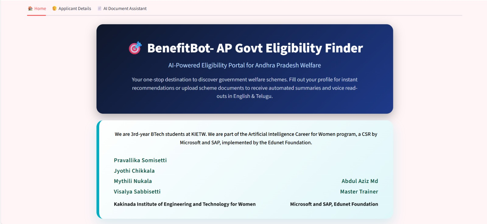
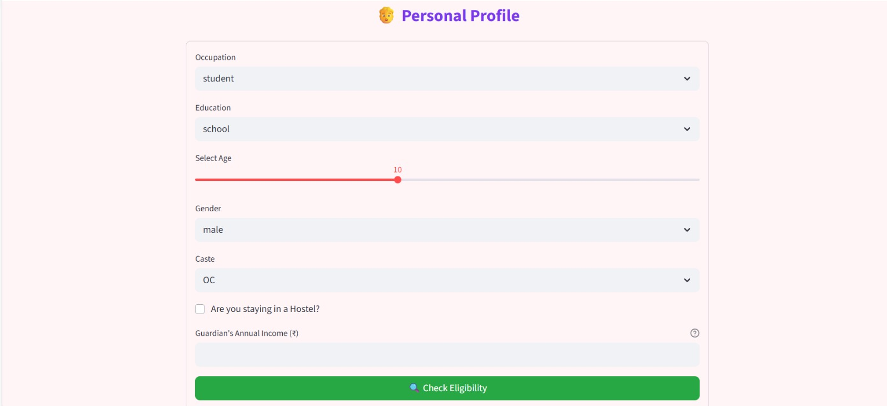
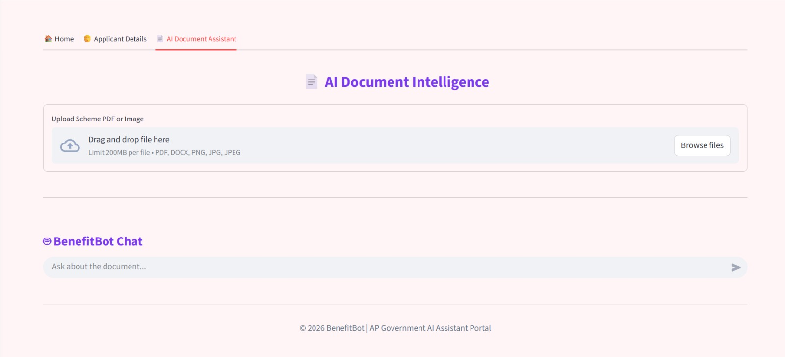

# AICW Final Project  
# BenefitBot- AP govt Eligibility Finder

---

#  Project Problem Statement
Many citizens are unaware of the government schemes and scholarships for which they are eligible. Existing government portals are often complex, text-heavy, and require users to already understand eligibility rules, categories, and documentation procedures.  
Due to this lack of accessibility and clarity, many deserving individuals fail to benefit from government welfare programs.

**The problem addressed in this project is:**  
*How can we provide a simple, intelligent, and user-friendly system that automatically identifies and informs users about the government schemes and scholarships they are eligible for based on their personal and socio-economic details?*

---

#  Solution Approach
This project proposes an intelligent eligibility recommendation system that simplifies access to government schemes and scholarships.  
The application collects essential user details such as age, income, gender, education level, and category. Based on these inputs, the system applies predefined eligibility rules and matches them with available schemes.

To enhance accessibility and usability, the solution integrates:
- signup/login page
- Automated eligibility matching
- AI-powered chatbot support
- Voice-based assistance for better inclusivity

The system is designed to be modular, scalable, and easy to extend with additional schemes and eligibility rules in the future.

---

#  Project Features
- Automatic eligibility checking based on user inputs  
-  AI-powered chatbot for scheme-related queries
-  AI document scanning intelligence
-  Text Extraction on document in english & telugu 
-  Voice assistance (Text-to-Speech) for scheme explanations  
-  Simple and intuitive user interface  
-  Accurate and relevant scheme recommendations  
-  Modular and maintainable code structure  
-  Easy integration of new schemes and rules  

---

#  Chatbot Feature Description
The chatbot feature allows users to interact with the system in a conversational manner.  
Users can ask questions related to:
- Scheme details
- Eligibility conditions
- Required documents
- Application guidance  

The chatbot processes user queries and provides clear, concise responses, reducing the need for manual searching and improving overall user experience.

---

#  Voice Feature Description
To make the system more accessible, especially for users with limited literacy or visual challenges, a voice-based feature is implemented.  
The system converts scheme details and eligibility information into speech, allowing users to listen to the information instead of reading it.

This feature enhances inclusivity and ensures that information reaches a wider audience.

---

# Screenshots

  <b>Login Page</b> 
  

  <b>Home Page</b> 
  

  <b>Applicant Details & Eligibility Form</b> 
  

  <b>AI Document Intelligence & Chatbot</b> 
  

# Video 

https://github.com/user-attachments/assets/e57f303b-b4dc-4cac-9f16-9561a35ae9c1

AICW-Final-Project/
│
├── app.py              # Main application logic
├── requirements.txt    # Required Python libraries
├── README.md           # Project documentation
├── .gitignore          # Git ignored files
├── assets/             # Screenshots and static files
└── data/               # Scheme and eligibility data

# 📄 File Descriptions

## app.py
Implements user input handling, eligibility logic, chatbot interaction, and voice output.

### requirements.txt
Lists all dependencies required to execute the project.

### README.md
Provides complete documentation including problem statement, solution, and usage instructions.

### .gitignore
Ensures unnecessary files are not tracked in the GitHub repository.

### assets/
Contains screenshots and images related to the project.

# ▶️ Steps to Run the Project

-> Clone the GitHub repository:
git clone https://github.com/PravallikaSomisetti/AICW-Final-Project.git

-> Navigate to the project directory:
cd AICW-Final-Project

-> Install required dependencies:
pip install -r requirements.txt

-> Run the application:
python app.py

Enter user details, interact with the chatbot, and listen to voice-based scheme explanations.

# 🎓 Learning Outcomes

Practical implementation of AI-assisted systems
Understanding of rule-based decision systems
Experience with chatbot and voice integration
Improved problem-solving and software design skills

## 👩‍💻 Author

Pravallika Somisetti

AICW Final Project

